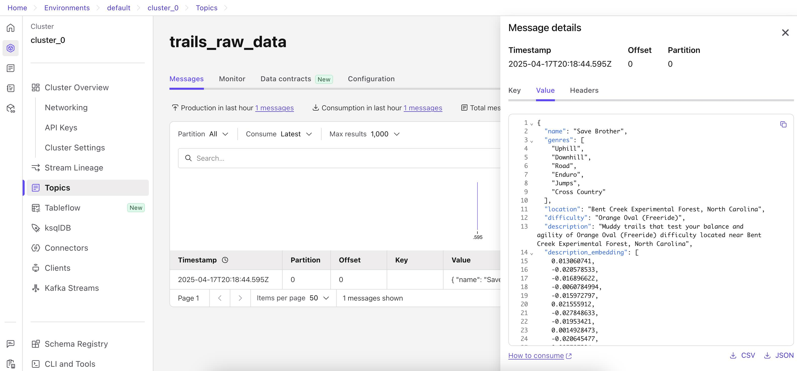
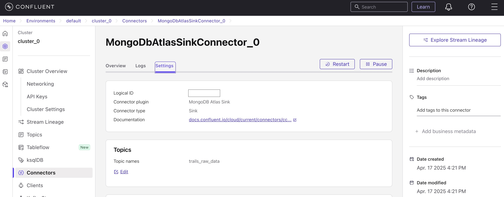
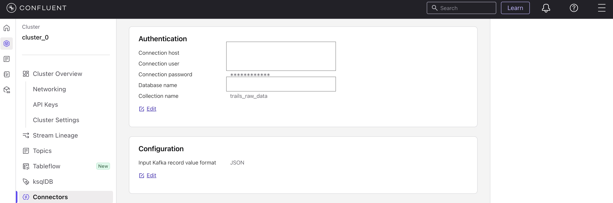
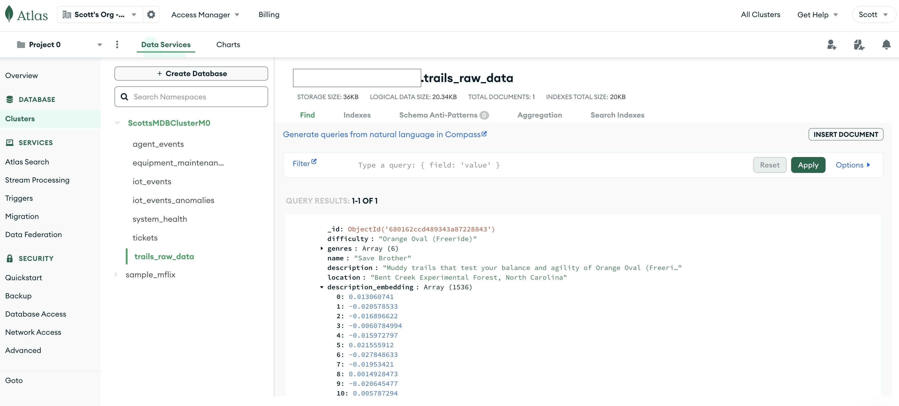

# Confluent's Fully Managed Connector (FMC) for MongoDB Atlas

<br>

# Overview

The question was: can you use Confluent's Fully Managed Connector (FMC) for MongoDB Atlas as a sink and sink embeddings? And specifically is it possible to create the embeddings in an external program and stored in a Confluent Kafka topic and sinked using the FMC. In other words, the embeddings are not created inside Confluent Flink using ML_PREDICT, for intance.

The answer is: yes, you can

This repo can help you prove it out on your own without complicated infrastructure. Hands-on, but super easy to do. This repo:
- creates mock mountain biking trail data
- the mock data contains embeddings generated on the fly from OpenAI
- inserts each mock record into Confluent kafka as individual events
- sinks the data using Confluent's FMC to MongoDB Atlas

If you get stuck, remember in the Confluent Cloud UI is the Confluent AI Assistant. It can not only answer questions, but generate code for you!

The assumption here is you are comfortable logging into Confluent Cloud, have an OpenAI API key and doing things like running python programs and installing required libraries from pip.

Remember to tear down your connector in Confluent Cloud to avoid getting charged.

<br>

## Login to Confluent Cloud and create a topic and publish data

Create a topic named 'trails_raw_data' or edit your .env file to use a different name.

<br>

## Run the Python datagen program

Edit your [`.env`](./.env) file with your OpenAI credentials.

Edit your [`client.properties`](./.env) file with your Confluent Cloud credentials.

Then run the datagen program:

```python
./producer_trails.py 1
```

You can just run it with 1 or change the number of mock events to publish to Confluent kafka.

📄 View the script: [`producer_trails.py`](./producer_trails.py)

If everything goes right, you should be able to view the data you produced in your MongoDB table!

You can see the embeddings were created as part of the message.

<table>
  <tr>
    <td>
      <strong>`topic data`</strong><br>
      <a href="./screenshot1_cc_topic_trails.jpg" target="_blank">
        
      </a>
    </td>
  </tr>
</table>

<br>

## Create a MongoDB Atlas Sink Connector

The connector settings are standard access credentials to your MongoDB Atlas endpoint.

<table>
  <tr>
    <td>
      <strong>`fmc connector`</strong><br>
      <a href="./screenshot1_cc_mongosinkconnector.jpg" target="_blank">
        
      </a>
    </td>
  </tr>
  <tr>
    <td>
      <a href="./screenshot2_cc_mongosinkconnector.jpg" target="_blank">
        
      </a>
    </td>
  </tr>
</table>

<br>

## Login to MongoDB Atlas and check out your collection

Your data should be flowing to your collection!

<table>
  <tr>
    <td>
      <strong>`mongodb atlas table`</strong><br>
      <a href="./screenshot3_mongo_db_trails.jpg" target="_blank">
        
      </a>
    </td>
  </tr>
</table>

<br>

## Final thoughts

Hope that helps answer the question.

Just remember to tear your environment down once you're done.
